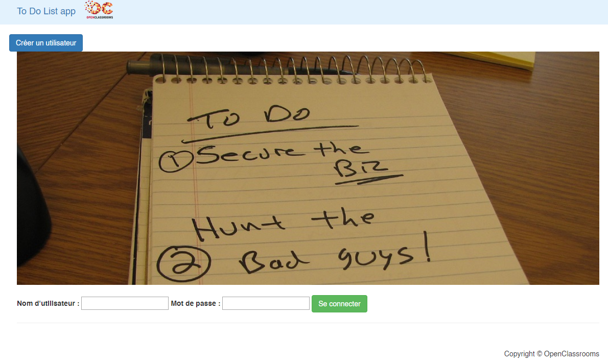

# TodoList


[](https://www.codacy.com/manual/bpel/todolist?utm_source=github.com&amp;utm_medium=referral&amp;utm_content=bpel/todolist&amp;utm_campaign=Badge_Grade)

## About the project
Improvement of a To Do List application:
- Correction of anomalies
- Implementation of new features
- Production of technical documentation / code audit
### Prerequisites
```
PHP > 5.5.9
MySQL >= 8.0.17
Symfony ^ 3.4
Twig >= 1.5
```
### Download or clone the repository
```
Git clone https://github.com/bpel/todolist.git
```
## Download dependencies
```
// from /todolist/
composer install
```
## Config

`app/config/parameters.yml`

```
# This file is auto-generated during the composer install
parameters:
    database_host: DATABASE_HOST (127.0.0.1)
    database_port: DATABASE_PORT (null)
    database_name: DATABASE_NAME (todolist)
    database_user: DATABASE_USER
    database_password: DATABASE_PASSWORD
    mailer_transport: MAILER_TRANSPORT
    mailer_host: MAILER_HOST
    mailer_user: MAILER_USER
    mailer_password: MAILER_PASSWORD
    secret: SECRET_TOKEN
```

### Task audit
``
php bin/console task:audit
``

## Deployment

``
php bin/console server:run
``

### Default users

| username | password | role  |
|----------|----------|-------|
| admin    | admin    | admin |
| user     | user     | user  |